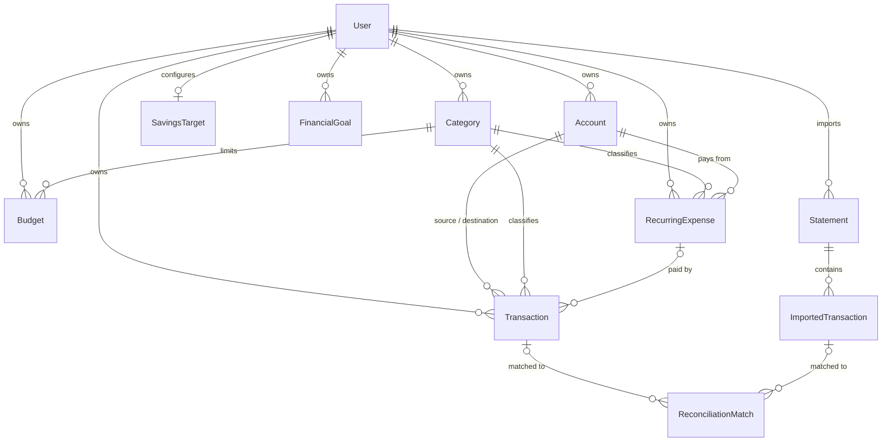

# Frontend Integration Guide

Version: 2.0

Audience: whoever builds the web frontend for this API (any framework).

---

# 1. What this app is

A personal finance backend (single user today, architected to grow later). It tracks accounts, categorizes income/expenses, records transactions with automatically-updated balances, enforces budgets, generates read-only reports, imports bank/wallet statements, reconciles them against manual entries, computes an overall "financial health" score, and — the newest layer — helps the user *plan ahead*: recurring bills, a monthly income/spending/savings breakdown, and purchase goals with feasibility projections.

Thirteen product modules, implemented in this dependency order (useful to know because it mirrors how the data model composes):

```
Auth → Users → Accounts → Categories → Transactions → Budgets → Reports
                                                      ↘ Statement Import → Reconciliation
                                                                          ↘ Financial Health
                                     ↘ Recurring Expenses → Spending Plan → Financial Goals
```

Reports, Statement Import, Reconciliation and Financial Health all read from Transactions/Accounts/Categories/Budgets — they never invent their own copy of that data.

The planning layer (Recurring Expenses → Spending Plan → Financial Goals) is deliberately a straight line with no cycles: Spending Plan never knows about Financial Goals, only the reverse. If you're building screens that mix the two (e.g. "how does this goal affect my monthly plan"), the frontend is the one combining two independent API calls — the backend won't do it for you.

---

# 2. Running the backend locally

```bash
nvm use            # Node version pinned in .nvmrc
pnpm install
pnpm prisma generate
npm run start:dev  # http://localhost:3000
```

Required env vars (see `.env.example`): `DATABASE_URL`, `JWT_ACCESS_SECRET`, `JWT_ACCESS_EXPIRATION`, `JWT_REFRESH_SECRET`, `JWT_REFRESH_EXPIRATION`, `PORT` (default 3000).

**Swagger/OpenAPI UI is already live at `GET /docs`.** It's generated straight from the DTOs and decorators in the code, so it is always accurate — treat it as the source of truth over this document whenever they disagree. This document exists to explain the *shape and reasoning* behind the API; Swagger is where you check the exact current contract.

**CORS is enabled.** In development, any origin is allowed by default (no config needed — just point your dev server at the API and it works). In production, set `CORS_ORIGIN` to a comma-separated list of allowed origins (e.g. `https://app.example.com,https://staging.example.com`) — without it, cross-origin requests are blocked in production.

---

# 3. Authentication

JWT access + refresh tokens (`Auth` module, `/auth` prefix — only `register` and `login` are public):

| Step | Call |
|---|---|
| Create account | `POST /auth/register` → `{ user, tokens: { accessToken, refreshToken } }` |
| Log in | `POST /auth/login` → `{ accessToken, refreshToken }` |
| Use the API | Send `Authorization: Bearer <accessToken>` on every other request |
| Access token expired | `POST /auth/refresh` with `Authorization: Bearer <refreshToken>` → new token pair |
| Log out | `POST /auth/logout` (Bearer access token) → revokes the stored refresh token |

Practical advice: write one HTTP client wrapper with a response interceptor that, on `401`, calls `/auth/refresh` once and retries the original request. Store both tokens (e.g. access in memory, refresh in an httpOnly-ish storage strategy you're comfortable with) — the backend has no cookie/session support, it's pure Bearer-token.

---

# 4. General conventions (apply across almost every module)

- **All routes require a Bearer token** except `POST /auth/register` and `POST /auth/login`.
- **Money is never a bare number.** Any monetary field is `{ amount: number, currency: string }` (currency is `"PEN"` or `"USD"` today — `SUPPORTED_CURRENCIES`). Never sum `amount` fields across rows without checking they share the same `currency`.
- **Archive, don't delete.** Accounts, Categories, Budgets, Transactions, Recurring Expenses all use a soft-delete pattern: `PATCH /<resource>/:id/archive` and `PATCH /<resource>/:id/restore`, with list endpoints defaulting to only the active ones (`status=ACTIVE` or `active=true`) unless you explicitly ask for archived ones via the query param. Financial Goals is the one exception — it has a 3-value `status` (`ACTIVE`/`ACHIEVED`/`ARCHIVED`) instead of a boolean, see its section below.
- **No pagination anywhere yet.** List endpoints return the full filtered array. Fine at personal-finance scale; don't build infinite-scroll assuming a `page`/`cursor` param that doesn't exist.
- **Dates** are ISO 8601 strings in requests (`transactionDate`, `dateFrom`, `dateTo`, `startDate`, `endDate`, etc.) and ISO strings in JSON responses.
- **Validation is strict**: the global `ValidationPipe` uses `whitelist + forbidNonWhitelisted`, so sending a field that isn't in the DTO causes a `400`, not a silent ignore. Match your request bodies exactly to what's in Swagger.
- **Ownership is always enforced** by `userId` server-side — trying to read/write another user's resource returns `404 Not Found` (never a `403`, to avoid confirming the resource exists).
- **Computed fields can be `null` instead of a fabricated number.** Financial Goals' feasibility and Spending Plan's breakdown never invent a value when the underlying data doesn't exist for that currency/period — render `null` as "not enough data yet", not as zero.
- **Errors** follow Nest's default shape: `{ statusCode, message, error }` (message can be a string or, for Statement Import row-validation failures, an object with a `message` + `errors[]` array).

---

# 5. Domain model at a glance



- **Account**: a bank account, cash, or digital wallet. `currentBalance` is always calculated (never editable directly) — it's automatically adjusted whenever a Transaction touching it is created, archived or restored.
- **Category**: `EXPENSE` or `INCOME` only. Transfers never use a category.
- **Transaction**: the single entity for `EXPENSE` / `INCOME` / `TRANSFER`. Amount is always a positive number; the sign/direction is implied by `type`. Once created, only `categoryId`, `notes` and `transactionDate` can change — amount/type/accounts are immutable (change them by archiving and creating a new one).
- **Budget**: a spending limit for one `EXPENSE` category over a date range. `spent`/`remaining`/`usagePercentage`/`status` are computed live from active Transactions, never stored.
- **Statement / ImportedTransaction**: a parsed bank/wallet export, kept completely separate from manual Transactions until reconciled.
- **ReconciliationMatch**: an immutable, append-only decision log (`MATCHED` / `UNMATCHED` / `IGNORED`) linking a Transaction to an ImportedTransaction. Match *candidates* are computed live and are never persisted — only decisions are.
- **RecurringExpense**: a reusable template for a bill that repeats weekly or monthly (rent, subscriptions). It is **not** a Transaction — "paying" it creates a real Transaction linked back via `recurringExpenseId`, which is how the API knows a period has already been paid.
- **SavingsTarget**: one row per user (a setting, not a list) — just a percentage of income the user wants to save. Everything else Spending Plan shows is computed on the fly, never stored.
- **FinancialGoal**: a future purchase or savings objective (`ACTIVE`/`ACHIEVED`/`ARCHIVED`, not the boolean pattern used elsewhere). `currentSavedAmount` is a plain number the user edits by hand — it is not wired to any Account balance.

---

# 6. Endpoint reference

All paths below are complete (there is no global prefix). "Auth" = requires `Authorization: Bearer <accessToken>` unless noted otherwise.

## Auth (`/auth`)

| Method & path | Auth | Body | Returns |
|---|---|---|---|
| `POST /auth/register` | no | `username, firstName, lastName, email, password (min 8), phoneNumber` | `{ user, tokens }` |
| `POST /auth/login` | no | `email, password` | `{ accessToken, refreshToken }` |
| `POST /auth/refresh` | refresh token | — | `{ accessToken, refreshToken }` |
| `POST /auth/logout` | yes | — | 204 No Content |

## Users (`/users`)

| Method & path | Body/Query | Returns |
|---|---|---|
| `GET /users/me` | — | `UserEntity` |
| `PATCH /users/me` | `firstName?, lastName?, phoneNumber?, preferredCurrency?, timezone?, language?` (all optional; email is read-only) | `UserEntity` |

`UserEntity`: `id, username, firstName, lastName, email, phoneNumber, preferredCurrency, timezone, language, createdAt, updatedAt`.

## Accounts (`/accounts`)

| Method & path | Body/Query | Returns |
|---|---|---|
| `POST /accounts` | `name, institution?, accountType (BANK_ACCOUNT\|CASH\|DIGITAL_WALLET), currency, initialBalance, notes?` | `AccountEntity` |
| `GET /accounts` | `status?` (default `ACTIVE`) | `AccountEntity[]` |
| `GET /accounts/:id` | — | `AccountEntity` |
| `PATCH /accounts/:id` | `name?, institution?, accountType?, notes?` | `AccountEntity` |
| `PATCH /accounts/:id/archive` | — | `AccountEntity` |
| `PATCH /accounts/:id/restore` | — | `AccountEntity` |

`AccountEntity`: `id, userId, name, institution, accountType, initialBalance: Money, currentBalance: Money, status (ACTIVE\|ARCHIVED), notes, createdAt, updatedAt`.

## Categories (`/categories`)

| Method & path | Body/Query | Returns |
|---|---|---|
| `POST /categories` | `name, type (EXPENSE\|INCOME), description?, color?, icon?` | `CategoryEntity` |
| `GET /categories` | `type?, active?` (default `true`) | `CategoryEntity[]` |
| `GET /categories/:id` | — | `CategoryEntity` |
| `PATCH /categories/:id` | `name?, type?, description?, color?, icon?` | `CategoryEntity` |
| `PATCH /categories/:id/archive` | — | `CategoryEntity` |
| `PATCH /categories/:id/restore` | — | `CategoryEntity` |

`CategoryEntity`: `id, userId, name, type, description, color, icon, active, createdAt, updatedAt`. Name is unique per user+type.

## Transactions (`/transactions`)

| Method & path | Body/Query | Returns |
|---|---|---|
| `POST /transactions` | `type (EXPENSE\|INCOME\|TRANSFER), accountId, toAccountId? (transfer only), categoryId? (expense/income only), amount (>0), transactionDate, notes?` | `TransactionEntity` |
| `GET /transactions` | `accountId?, categoryId?, type?, status? (default ACTIVE), dateFrom?, dateTo?, minAmount?, maxAmount?, sortBy? (date\|amount\|category\|account, default date), sortOrder? (asc\|desc, default desc)` | `TransactionEntity[]` |
| `GET /transactions/:id` | — | `TransactionEntity` |
| `PATCH /transactions/:id` | `categoryId?, transactionDate?, notes?` | `TransactionEntity` |
| `PATCH /transactions/:id/archive` | — | `TransactionEntity` (reverses its balance effect) |
| `PATCH /transactions/:id/restore` | — | `TransactionEntity` (re-applies its balance effect) |

`TransactionEntity`: `id, userId, accountId, toAccountId, categoryId, type, amount: Money, transactionDate, notes, status (ACTIVE\|ARCHIVED), createdAt, updatedAt`. Filtering by `accountId` includes transfers where the account is either source or destination.

## Budgets (`/budgets`)

| Method & path | Body/Query | Returns |
|---|---|---|
| `POST /budgets` | `name, categoryId (must be EXPENSE), amount (>0), currency, period (WEEKLY\|MONTHLY), startDate, endDate` | `BudgetEntity` |
| `GET /budgets` | `categoryId?, period?, active?` (default `true`) | `BudgetEntity[]` |
| `GET /budgets/:id` | — | `BudgetEntity` |
| `PATCH /budgets/:id` | `name?, amount?, period?, startDate?, endDate?` | `BudgetEntity` |
| `PATCH /budgets/:id/archive` | — | `BudgetEntity` |
| `PATCH /budgets/:id/restore` | — | `BudgetEntity` |

`BudgetEntity`: `id, userId, categoryId, name, amount: Money, spent: Money, remaining: Money, usagePercentage, status (HEALTHY\|WARNING\|EXCEEDED), period, startDate, endDate, active, createdAt, updatedAt`. `spent`/`remaining`/`status` are always computed, never sent in requests.

## Reports (`/reports`) — read-only

| Method & path | Query | Returns |
|---|---|---|
| `GET /reports/summary` | `dateFrom, dateTo (required), accountId?` | income/expenses/net/avg-daily-expense/highest-category per currency |
| `GET /reports/by-category` | `type (EXPENSE\|INCOME, required), dateFrom, dateTo, accountId?` | totals + per-category breakdown per currency |
| `GET /reports/cash-flow` | `dateFrom, dateTo, groupBy? (day\|week\|month, default month), accountId?` | bucketed income/expenses/net series per currency |
| `GET /reports/accounts/:accountId/balance-history` | `dateFrom?, dateTo?` | running balance per transaction |
| `GET /reports/budget-performance` | `categoryId?, period?, active?` | same shape as `GET /budgets` |

## Statement Import (`/statement-imports`) — multipart/form-data

Only `YAPE` is a supported `provider` today (BCP etc. are future). There's no real Yape column layout hard-coded — **you tell the API which columns mean what** at upload time.

| Method & path | Form fields | Returns |
|---|---|---|
| `POST /statement-imports/preview` | `file` + `provider (YAPE), accountId, dateColumn, descriptionColumn, amountColumn, currencyColumn?, externalIdColumn?, referenceColumn?, dateFormat?` | parsed rows + per-row errors, **nothing persisted** |
| `POST /statement-imports` | same fields | persists the `Statement` + its `ImportedTransaction` rows (rejects the whole file if any row failed validation — run `/preview` first) |
| `GET /statement-imports` | `accountId?, provider?, status?` | `StatementEntity[]` |
| `GET /statement-imports/:id` | — | `StatementEntity` |
| `GET /statement-imports/:id/transactions` | — | `ImportedTransactionEntity[]` |

`dateColumn`/`descriptionColumn`/`amountColumn` refer to the **header names** in the uploaded CSV/XLSX, not positions. `dateFormat` (e.g. `DD/MM/YYYY`) is only needed when dates aren't ISO 8601.

## Reconciliation (`/reconciliation`)

| Method & path | Body/Query | Returns |
|---|---|---|
| `GET /reconciliation/candidates` | `accountId?` | live-computed suggested matches (never persisted) |
| `POST /reconciliation/matches` | `importedTransactionId, transactionId` | confirms a match → `ReconciliationMatchEntity` (status `MATCHED`) |
| `POST /reconciliation/matches/reject` | `importedTransactionId, transactionId` | records a rejection → status `UNMATCHED` |
| `POST /reconciliation/matches/ignore` | `importedTransactionId` | status `IGNORED` |
| `GET /reconciliation/history` | `status?` | `ReconciliationMatchEntity[]` (immutable audit log) |

A confirmed match is required to have the same account and currency on both sides — a `400` means you're trying to pair records that can't logically be the same movement.

## Financial Health (`/financial-health`) — read-only

| Method & path | Query | Returns |
|---|---|---|
| `GET /financial-health/score` | `dateFrom, dateTo (required), accountId?` | `{ score: 0-100 \| null, rating, indicators }` |
| `GET /financial-health/indicators` | same | savings rate, expense growth, cash flow trend, budget compliance, per currency |
| `GET /financial-health/history` | `dateFrom, dateTo, groupBy? (week\|month)` | array of `{ periodStart, periodEnd, score, rating }` |

`score`/`rating` are computed for the user's `preferredCurrency` (set via `PATCH /users/me`); components with no data (e.g. no budgets yet) are excluded from the weighted average rather than faked.

## Recurring Expenses (`/recurring-expenses`)

| Method & path | Body/Query | Returns |
|---|---|---|
| `POST /recurring-expenses` | `name, categoryId (must be EXPENSE), accountId, amount (>0), frequency (WEEKLY\|MONTHLY), dayOfMonth? (1-31, required if MONTHLY), dayOfWeek? (0-6, required if WEEKLY, native JS day-of-week convention — see tip below), startDate, endDate?` | `RecurringExpenseEntity` |
| `GET /recurring-expenses` | `categoryId?, accountId?, frequency?, active?` (default `true`) | `RecurringExpenseEntity[]` |
| `GET /recurring-expenses/projected` | `dateFrom, dateTo` (required) | array of `{ recurringExpenseId, name, amount: Money, dueDate, paid, transactionId }` — every expected due date in the range, computed live |
| `GET /recurring-expenses/:id` | — | `RecurringExpenseEntity` |
| `PATCH /recurring-expenses/:id` | `name?, amount?, frequency?, dayOfMonth?, dayOfWeek?, startDate?, endDate?` (currency, category and account are fixed at creation) | `RecurringExpenseEntity` |
| `PATCH /recurring-expenses/:id/archive` \| `/restore` | — | `RecurringExpenseEntity` |
| `POST /recurring-expenses/:id/pay` | `amount?, transactionDate?, notes?` (all optional — override the template if this period's bill differs) | `TransactionEntity` — a real Transaction, linked back via `recurringExpenseId` |

`RecurringExpenseEntity`: `id, userId, categoryId, accountId, name, amount: Money, frequency, dayOfMonth, dayOfWeek, startDate, endDate, active, currentPeriod: { start, end, paid, transactionId }, createdAt, updatedAt`. `currentPeriod` is always the period containing *today*; use `GET /recurring-expenses/projected` to look at other periods (past or future). Paying twice in the same period returns a `409`.

## Spending Plan (`/spending-plan`)

| Method & path | Body/Query | Returns |
|---|---|---|
| `GET /spending-plan` | `dateFrom, dateTo` (required) | income/committed/other/savings/available breakdown, per currency (see shape below) |
| `GET /spending-plan/savings-target` | — | `{ percentage: number, updatedAt: string \| null }` — `0` and `null` if never configured |
| `PATCH /spending-plan/savings-target` | `percentage` (0-100) | same shape, upserted |

`GET /spending-plan` returns `{ dateFrom, dateTo, savingsTargetPercentage, byCurrency: [{ currency, income: Money, committedExpenses: Money, otherExpenses: Money, savingsTarget: Money, available: Money, committedPercentage, otherPercentage, savingsTargetPercentage, availablePercentage }] }`. `committedExpenses` comes from Recurring Expenses' projection for that range (what's *expected*, not necessarily what's been paid yet); `otherExpenses` is every other Expense transaction not linked to a recurring expense — the two never overlap, so `committed + other` is safe to sum. This is the endpoint that answers "I earn X, I'm spending Y%, I have Z% free."

## Financial Goals (`/financial-goals`)

| Method & path | Body/Query | Returns |
|---|---|---|
| `POST /financial-goals` | `name, targetAmount (>0), currency, currentSavedAmount? (default 0), targetDate? (must be in the future), priority? (informational only), notes?` | `FinancialGoalEntity` |
| `GET /financial-goals` | `status?` (default `ACTIVE`) | `FinancialGoalEntity[]` |
| `GET /financial-goals/:id` | — | `FinancialGoalEntity` |
| `GET /financial-goals/:id/feasibility` | — | feasibility breakdown (see shape below) |
| `PATCH /financial-goals/:id` | `name?, targetAmount?, targetDate?, priority?, notes?` | `FinancialGoalEntity` |
| `PATCH /financial-goals/:id/saved-amount` | `currentSavedAmount` (required, ≥0) | `FinancialGoalEntity` — separate from the general update on purpose |
| `PATCH /financial-goals/:id/archive` \| `/restore` | — | `FinancialGoalEntity` |
| `PATCH /financial-goals/:id/achieve` | — | `FinancialGoalEntity` (status → `ACHIEVED`; only allowed from `ACTIVE`) |

`FinancialGoalEntity`: `id, userId, name, targetAmount: Money, currentSavedAmount: Money, targetDate, priority, status (ACTIVE\|ACHIEVED\|ARCHIVED), notes, createdAt, updatedAt`.

`GET /financial-goals/:id/feasibility` returns:
```
{
  goalId, remainingNeeded: Money, affordableNow: boolean,
  currentPeriod: { start, end, available: Money | null, affordable: boolean | null },
  nextPeriod:    { start, end, available: Money | null, affordable: boolean | null },
  estimatedPeriodsLeft: number | null
}
```
`currentPeriod`/`nextPeriod` are always calendar months. `available` reads from Spending Plan for the goal's currency — if the user has no Spending Plan data in that currency, it's `null` (not zero, not fabricated), and `affordable`/`estimatedPeriodsLeft` follow suit. **Known simplification**: if the user has several active goals, each one is evaluated as if it alone got 100% of the available amount — there's no cross-goal allocation yet, so don't present these as additive across goals in the UI.

---

# 7. Suggested build order for the frontend

Mirrors how the backend itself was built, since later screens depend on data from earlier ones:

1. **Auth** — register/login screens, token storage + refresh interceptor.
2. **Accounts + Categories** — basic CRUD list/detail/archive screens; nothing else works without at least one account and category.
3. **Transactions** — the core daily-use screen (create expense/income/transfer, list with filters, archive).
4. **Budgets** — depends on Categories.
5. **Reports + Financial Health** — pure dashboards/charts once there's transaction history to show.
6. **Statement Import + Reconciliation** — the most complex UI (file upload + column mapping form + a matching/review screen); save for last.
7. **Recurring Expenses** — a list of bills with "pay this period" buttons; needs Accounts + Categories from step 2.
8. **Spending Plan** — a single dashboard screen (the "I earn X, spend Y%, have Z% free" view); needs Recurring Expenses from step 7 to be meaningful.
9. **Financial Goals** — goal cards with a feasibility badge; needs Spending Plan from step 8 to compute anything.

---

# 8. Practical tips

- **Generate a typed API client from Swagger** instead of hand-writing request types. Swagger's JSON is at `GET /docs-json`; tools like `openapi-typescript`, `orval`, or your framework's codegen can turn it into typed fetch functions automatically, and stay in sync as the backend evolves.
- **A data-fetching library pays off immediately.** Every module follows the same `list (with filters) / get-by-one / create / patch / archive / restore` shape — TanStack Query (or your framework's equivalent) maps onto that very cleanly (one query key per resource, invalidate on mutation).
- **Render `Money` as one unit, always.** Don't split `amount` and `currency` across separate UI components that could drift.
- **Respect the immutability rules in the UI, don't just rely on the API rejecting requests** — e.g. don't offer to edit a Transaction's amount/type; offer "archive and create a new one" instead, since that's the only supported path.
- **The multi-currency reality is real, not theoretical**: a user can have a PEN account and a USD account. Any screen aggregating money (dashboards, reports) needs to group by currency rather than assuming one.
- **`null` means "not enough data", not "zero" or "error".** This shows up most in Financial Goals' feasibility and Financial Health's score — render it as an empty/neutral state ("add a transaction in this currency to see this"), not as `$0` or a broken widget.
- **Recurring Expenses' `dayOfWeek` uses plain JS `Date.getDay()` convention** (`0` = Sunday), which is *not* the same "Monday-start" convention Reports/Financial Health use internally for weekly buckets. It only matters if you're building your own date math client-side — the API always tells you the resulting `dueDate`/period boundaries directly, so you rarely need to compute this yourself.

---

Ping me once you've picked a framework and I'll help scaffold the first screens and wire up the API client.
